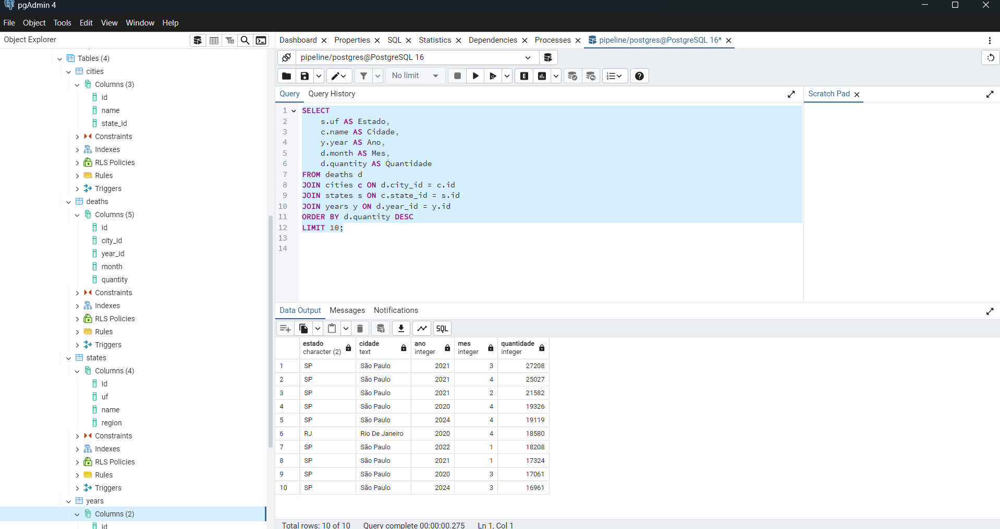
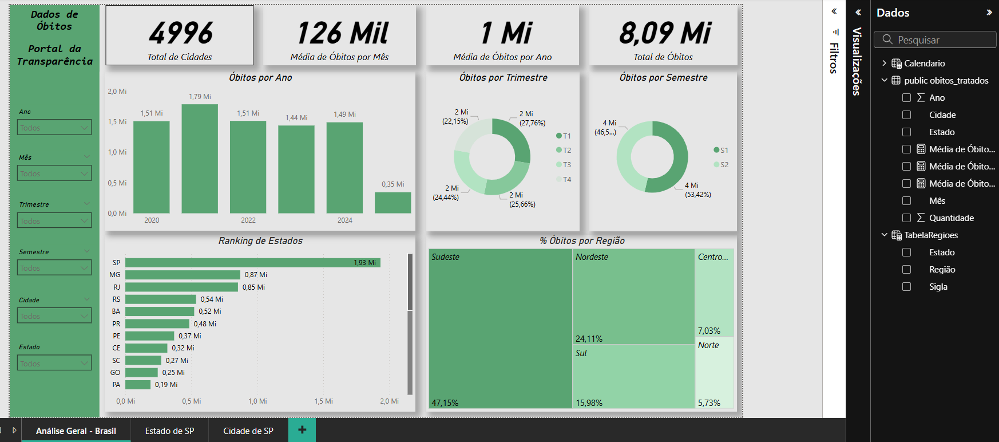
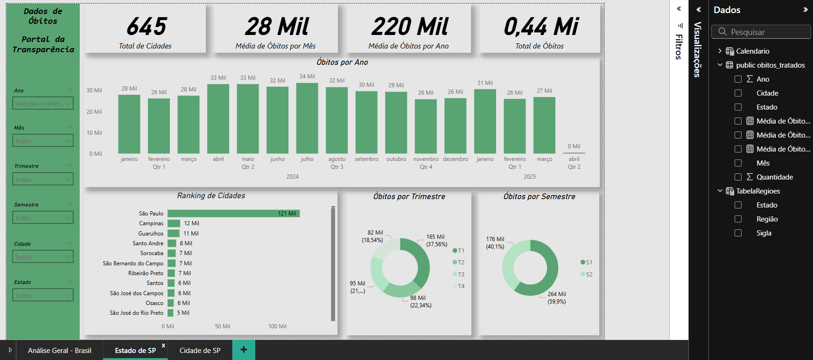
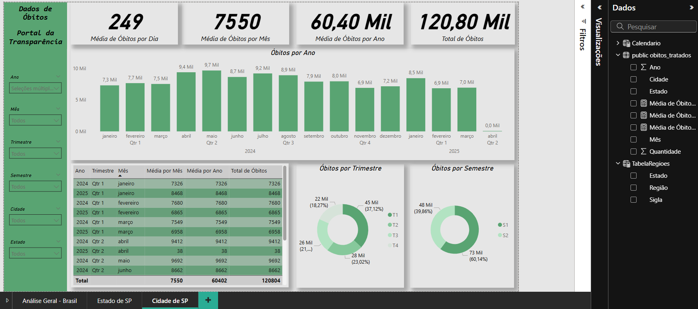

# 📊 Pipeline de Dados de Óbitos - Portal da Transparência

Este projeto implementa um pipeline completo para coleta, tratamento e armazenamento de dados públicos de óbitos no Brasil, obtidos via API do Portal da Transparência do Registro Civil. Os dados são tratados com `pandas` e armazenados em um banco de dados `PostgreSQL`, permitindo análises posteriores com ferramentas como o Power BI.

## 🚀 Funcionalidades

- Coleta dados por estado, mês e ano da API oficial
- Armazena os dados em `.csv`, `.parquet` ou `.xlsx`
- Realiza tratamento com `pandas` para limpeza e organização
- Envia os dados para um banco de dados PostgreSQL
- Conecta facilmente com Power BI para criação de dashboards
- Estrutura de projeto modular e pronta para expansão

## 🧱 Estrutura do Projeto

```bash
├── data/
│   └── raw/                  # Arquivos brutos coletados
├── src/
│   ├── __init__.py
│   ├── coleta.py             # Coleta da API
│   ├── tratamento.py         # Tratamento dos dados
│   ├── carga.py              # Envio para PostgreSQL
│   ├── pipeline.py           # Pipeline orquestradora
│   └── config.py             # Configurações e .env
├── main.py                   # Execução da pipeline
├── .env                      # Variáveis de ambiente do banco
├── requirements.txt          # Dependências do projeto
└── README.md
```

## ⚙️ Configuração

### 1. Clone o repositório

git clone https://github.com/seu-usuario/seu-repositorio.git
cd seu-repositorio

### 2. Crie e ative o ambiente virtual

python -m venv venv
source venv/bin/activate      # Linux/macOS
venv\Scripts\activate         # Windows

### 3. Instale as dependências

pip install -r requirements.txt

### 4. Configure o PostgreSQL

- Crie um banco de dados:

CREATE DATABASE dados_obitos;

- Crie um usuário com permissões apenas nesse banco:

CREATE USER admin_obitos WITH PASSWORD 'sua_senha_segura';
GRANT CONNECT ON DATABASE dados_obitos TO admin_obitos;
\c dados_obitos
GRANT USAGE, CREATE ON SCHEMA public TO admin_obitos;
ALTER DEFAULT PRIVILEGES IN SCHEMA public
GRANT SELECT, INSERT, UPDATE, DELETE ON TABLES TO admin_obitos;


## 🖼️ Tabela criada no Postgres após rodar o pipeline




### 5. Crie o arquivo `.env` na raiz do projeto com as variáveis do banco

DB_USER=seu_usuario
DB_PASS=sua_senha_segura
DB_HOST=localhost
DB_PORT=5432
DB_NAME=dados_obitos

## ▶️ Como Executar

Com tudo configurado, rode o pipeline com:

python main.py

O script fará:

1. Coleta de dados da API
2. Tratamento com pandas
3. Salvamento local do arquivo
4. Carga no PostgreSQL

## 📡 Fonte dos Dados

Os dados são obtidos do [Portal da Transparência do Registro Civil](https://transparencia.registrocivil.org.br/).

## 📊 Uso com Power BI

1. Abra o Power BI Desktop
2. Selecione "Obter Dados" → "Banco de Dados PostgreSQL"
3. Insira:
   - Servidor: localhost:5432
   - Banco de dados: dados_obitos
4. Autentique com o usuário `seu_usuario`
5. Selecione a tabela `obitos_tratados`

Agora você pode montar dashboards com filtros por período, localidade, cidade e quantidade de óbitos.

## 🖼️ Exemplos de Dashboards

### Visão Geral - Brasil



### Visão por Estado - São Paulo



### Visão por Cidade - São Paulo



## ✅ TODO

- [ ] Adicionar logs ao pipeline
- [ ] Implementar versão com Docker

## 📄 Licença

Este projeto é de uso pessoal e acadêmico. Consulte o Portal da Transparência para regras de uso dos dados.

## 🙌 Autor

Desenvolvido por [Victor Augusto Goveia da Rocha](https://github.com/victorgoveia)  
Contato: [victor.goov@gmail.com](mailto:victor.goov@gmail.com)
